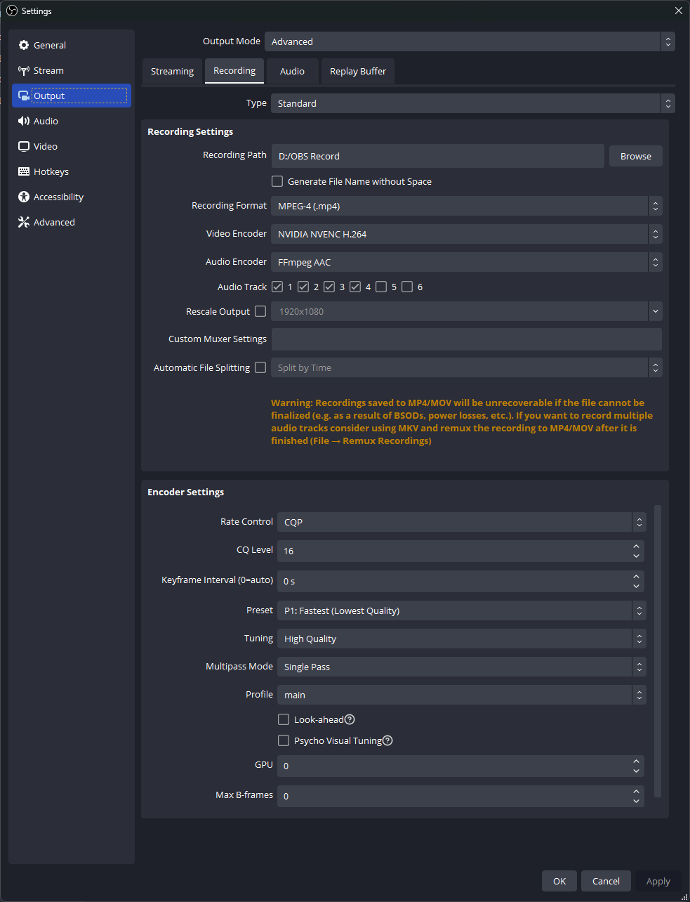

# Alternative to NVIDIA ShadowPlay

## Introduction
NVIDIA ShadowPlay is a great tool for recording gameplay, but it has some limitations. For example, it only works on Windows,it only works with NVIDIA graphics cards and you dont have any control over the sources being recorded.

## What is this?
OBS Replay Buffer is a inbuild feature in OBS Studio (Open Broadcaster Software) which allows you to record the last X seconds of your gameplay. This is great for recording those epic moments in your gameplay that you would like to share with your friends.

## How to use
1. Download and install [OBS Studio](https://obsproject.com/)
2. Open OBS Studio and go to `Settings` -> `Output` and set `Output Mode` to `Advanced`
3. Set your desired Recording Quality and Recording Format
   
   
OR

You can use the settings in the screenshot below

1. Go to Replay Buffer and set the `Replay Buffer Length` to your desired length. I recommend 60 seconds.
2. Go to `Hotkeys` and set a hotkey for `Save Replay Buffer`. 
3. Create a new scene and add the sources you want to record. For example, if you want to record your gameplay, add `Game Capture` as a source.
4. Create a Shortcut of OBS Studio and copy it to shell:startup(using Run). This will make OBS Studio start automatically when you start your PC.
5. Go to Properties of the Shortcut and add ` --disable-shutdown-check --startreplaybuffer` to the end of the `Target` field. This will make OBS Studio start recording automatically when you start your PC.
6. Now, whenever you want to save a clip, press the hotkey you set in step 5. The clip will be saved in the `Videos` folder. You can change the location of the folder in `Settings` -> `Output` -> `Recording Path`.
